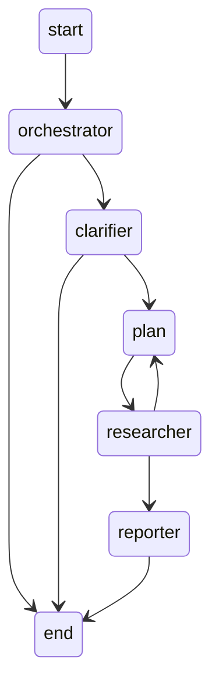

## 项目业务需求
* 分辨用户请求，简单问题调用 llm 直接回答然后结束，研究主题则进入下一步
* 模糊不清的研究主题生成不超过 3 个澄清问题让用户回答以进入下一步，用户拒绝则结束
* 根据当前研究主题生成执行计划，不超过 3 步，每步可能包含搜索 API 调用、知识库查询。只生成步骤，然后分发给具体节点执行
* 执行计划步骤中描述的操作，例如搜索 API 调用，知识库查询等
* 根据获取到的信息，生成研究报告并输出

## 项目流程图

orchestrator: 判定用户为题是否是研究问题，或者直接回复简单问题，需要llm
clarifier: 判定主题是否模糊，需用户介入，需要llm
planner: 制定研究计划，例如 1. 先
researchers: 工具调用，收集到多少材料、材料类型不定，需要tools，mcp
editor-in-chief: 写大纲，每一节的名字和描述，llm
editor: 写seciton，
reporter: 整合section，输出

research 相关的原子操作：
搜索资料
写大纲
写分段（大纲+资料）
评审

